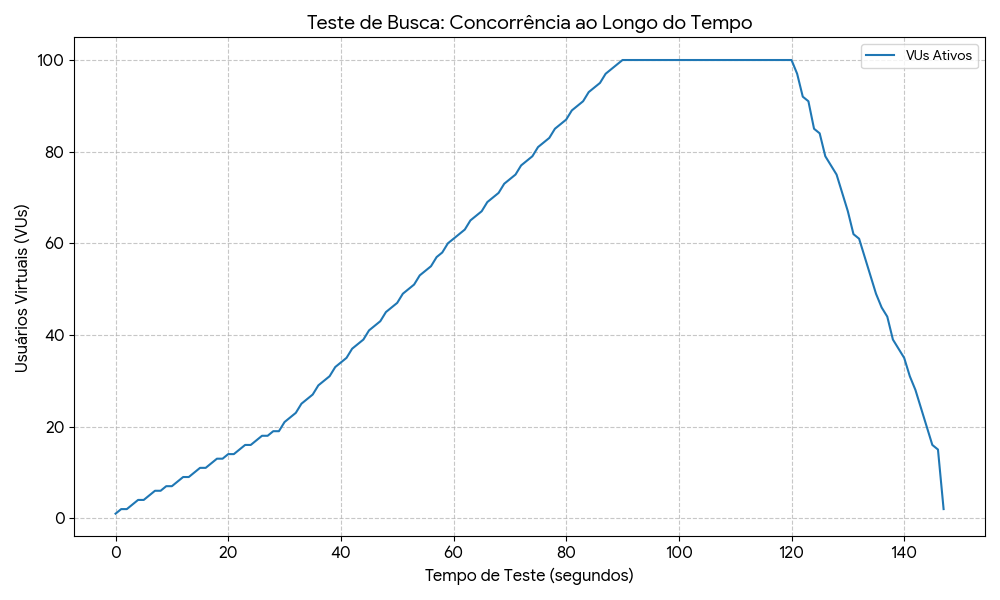
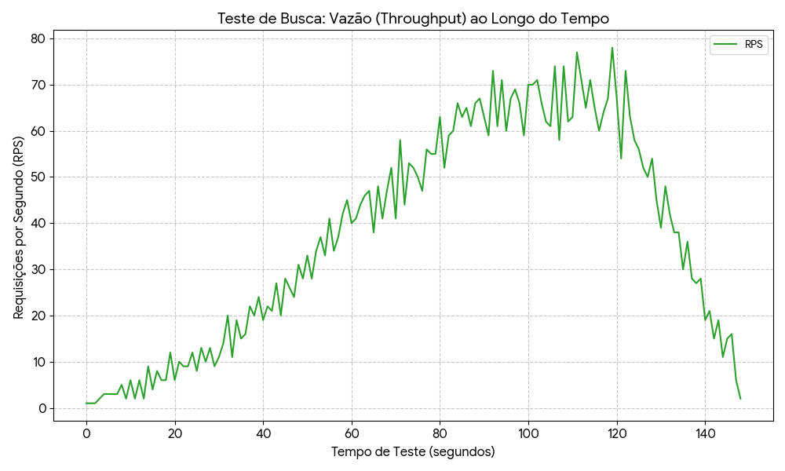
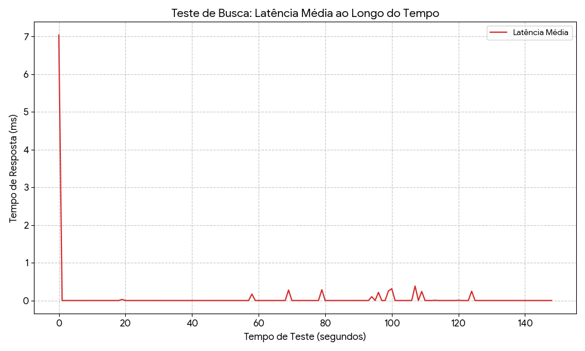
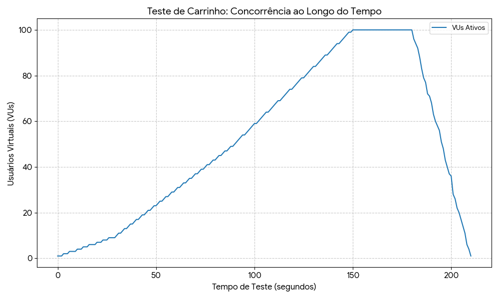
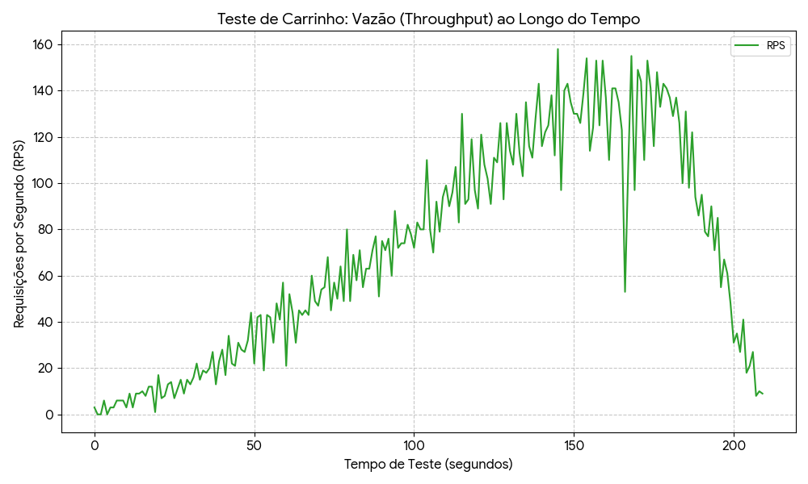
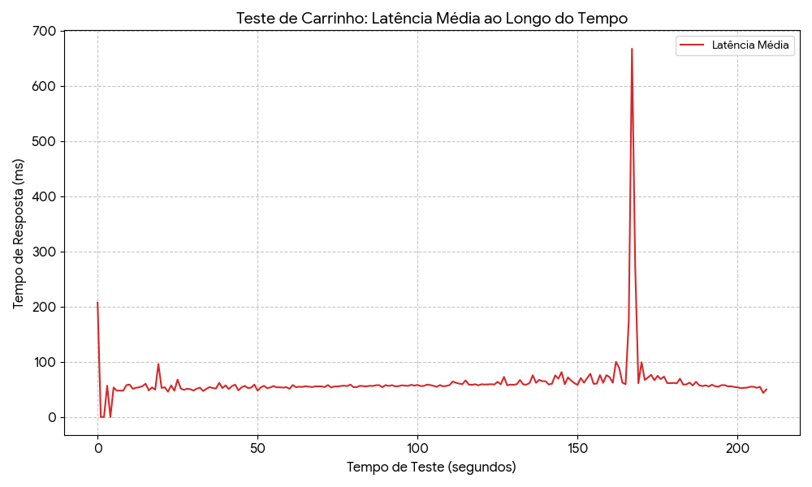

# RELATÓRIO DE MEDIÇÕES DO SLA 1 - ZENITH MARKETPLACE

**Data da medição:** 28/11/2025

**Ambiente:** Desenvolvimento Local (Ryzen 7 5800x, 16GB RAM)

**Ferramenta de Aferição:** Grafana k6

**Banco de Dados:** MySQL 8.0 + MongoDB

Este relatório apresenta a análise de desempenho de dois serviços críticos do sistema, evidenciando as curvas de evolução de **Latência**, **Vazão** e **Concorrência** sob carga variável.

---

## 1. Serviço: Busca de Produtos

Este cenário avaliou a performance de leitura do catálogo, simulando utilizadores a pesquisar por produtos. O teste seguiu uma curva de carga variável (Ramp-up, Platô, Ramp-down) atingindo até 100 utilizadores simultâneos.

* **Tipo de operações:** Leitura (`GET /api/produtos`)
* **Arquivos envolvidos:**
    * [`ProdutoController.java`](../../../../../../../../main/java/br/com/unirio/marketplace/zenith/controller/ProdutoController.java)
    * [`ProdutoService.java`](../../../../../../../../java/br/com/unirio/marketplace/zenith/service/ProdutoService.java)
    * [`ProdutoRepository.java`](../../../../../../../../java/br/com/unirio/marketplace/zenith/repository/ProdutoRepository.java)
* **Código de medição:** [`teste-busca.js`](teste-busca.js)

### Resultados do Teste de Carga (SLA)

| Métrica | Resultado | Análise |
| :--- | :--- | :--- |
| **Concorrência Máxima** | 100 VUs | O sistema suportou o pico de 100 utilizadores virtuais sem erros de conexão. |
| **Vazão Média (RPS)** | ~37.7 req/s | Considerando as pausas sleep simuladas, o servidor atendeu 100% das 5.590 requisições geradas. |
| **Latência (p95)** | ~7.03 ms | Tempo de resposta excelente. 95% das buscas foram resolvidas em menos de 10ms. |
| **Taxa de Erro** | 0.00% | Nenhuma requisição falhou (HTTP 200 OK em todas). |

### Evolução das Medições (Gráficos)

Abaixo apresenta-se a evolução temporal das métricas. Observe como a latência (vermelho) permanece estável mesmo com o aumento da concorrência (azul).

### LEVANTAMENTO DE HIPÓTESES dos potenciais gargalos

1.  **Alta Eficiência de Leitura:** O gráfico de latência manteve-se plano e próximo de zero (~7ms) mesmo durante o pico de 100 usuários. Isso indica que, para o volume de dados atual, o MySQL está a responder de forma extremamente eficiente, provavelmente servindo dados via cache de memória (Buffer Pool).
2.  **Escalabilidade Linear:** O gráfico de vazão (RPS) acompanhou perfeitamente a curva de concorrência. Não houve degradação de performance, sugerindo que o gargalo atual não é o banco de dados nem a CPU do servidor para operações de leitura simples.
3.  **Risco Futuro (Full Text Search):** A busca atual utiliza LIKE %termo% no SQL. Embora rápido agora, este método impede o uso eficiente de índices B-Tree tradicionais, forçando o banco a ler todos os registos (Full Table Scan). Com o crescimento do catálogo para milhões de produtos, esta operação tornar-se-á insustentável.
    * **Solução Proposta:** Migrar a funcionalidade de busca para tecnologias específicas de indexação textual, como ElasticSearch.

---

## 2. Serviço: Fluxo de Compra

Este cenário avaliou a capacidade de **escrita** e transações completas. Cada iteração simulou um novo visitante realizando o fluxo completo: **Registro** (MySQL) -> **Login** (JWT) -> **Adicionar ao Carrinho** (MongoDB).

* **Tipo de operações:** Escrita (`POST`), Leitura, Autenticação.
* **Arquivos envolvidos:**
    * [`CarrinhoController.java`](../../../../../../../../main/java/br/com/unirio/marketplace/zenith/controller/CarrinhoController.java)
    * [`CarrinhoService.java`](../../../../../../../../main/java/br/com/unirio/marketplace/zenith/service/CarrinhoService.java)
    * [`AuthController.java`](../../../../../../../../main/java/br/com/unirio/marketplace/zenith/controller/AuthController.java)
    * [`Carrinho.java`](../../../../../../../../main/java/br/com/unirio/marketplace/zenith/model/mongo/Carrinho.java)
* **Código de medição:** [`teste-carrinho.js`](teste-carrinho.js)

### Resultados do Teste de Carga (SLA)

O teste utilizou criação dinâmica de utilizadores para evitar *locks* e simular um cenário real de novos clientes.

| Métrica | Resultado | Análise |
| :--- | :--- | :--- |
| **Concorrência Máxima** | 100 VUs | Pico de 100 utilizadores realizando o fluxo completo simultaneamente. |
| **Vazão Média (RPS)** | 93.8 req/s | O sistema processou quase 100 operações complexas (registro/login/carrinho) por segundo. Total de 19.880 requisições. |
| **Latência (p95)** | 118.02 ms | Tempo de resposta consideravelmente maior que a busca, refletindo o custo de escrita. |
| **Latência Média** | 69.13 ms | Valor médio saudável para operações de escrita. |
| **Taxa de Erro** | 0.00% | O sistema manteve a integridade dos dados sob estresse. |

### Evolução das Medições (Gráficos)

Os gráficos abaixo revelam picos ("spikes") de latência correlacionados à entrada de novos utilizadores, evidenciando o custo de processamento das escritas.

### LEVANTAMENTO DE HIPÓTESES dos potenciais gargalos

1.  **Custo Computacional (CPU):** O processo de registo utiliza `BCrypt` para *hashing* de senhas. Esta operação é intencionalmente lenta e intensiva em CPU. Sob alta concorrência (100 VUs a criar contas), a CPU da aplicação torna-se o gargalo antes mesmo do banco de dados.
2.  **Operações Síncronas:** A adição ao carrinho é uma operação bloqueante. Embora o MongoDB tenha respondido bem (latência média ~69ms), em picos extremos de tráfego (ex: Black Friday), a acumulação de latência na escrita pode esgotar o pool de threads do servidor web, impedindo novos acessos.
    * **Solução Proposta:** Implementar uma arquitetura assíncrona utilizando filas de mensagens (como RabbitMQ ou Kafka) para desacoplar a receção do pedido de compra do processamento efetivo no banco de dados, garantindo resposta imediata ao utilizador.