# RELATÓRIO DE MEDIÇÕES DO SLA 2 - ZENITH MARKETPLACE

**Data da medição:** 28/11/2025

**Ambiente:** Desenvolvimento Local (Ryzen 7 5800x, 16GB RAM)

**Ferramenta de Aferição:** Grafana k6

**Banco de Dados:** MySQL 8.0 + MongoDB

Este relatório apresenta a análise de desempenho de dois serviços críticos do sistema, evidenciando as curvas de evolução de **Latência**, **Vazão** e **Concorrência** sob carga variável.

---

## 1. Serviço: Busca de Produtos

Este cenário avaliou a performance de leitura do catálogo, simulando utilizadores a pesquisar por produtos. O teste seguiu uma curva de carga variável (Ramp-up, Platô, Ramp-down) atingindo até 100 utilizadores simultâneos.

* **Tipo de operações:** Leitura (`GET /api/produtos`)
* **Arquivos envolvidos:**
    * [`ProdutoController.java`](../../../../../../../../main/java/br/com/unirio/marketplace/zenith/controller/CarrinhoController.java)
    * [`ProdutoService.java`](../../../../../../../../main/java/br/com/unirio/marketplace/zenith/service/ProdutoService.java)
    * [`ProdutoRepository.java`](../../../../../../../../main/java/br/com/unirio/marketplace/zenith/repository/ProdutoRepository.java)
* **Código de medição:** [`teste-busca.js`](teste-busca.js)

**Descrição das configurações:**
* **Ambiente:** Desenvolvimento Local (Docker).
* **Hardware:** Ryzen 7 5800x, 16GB RAM.
* **Cenário:** Carga progressiva até 100 VUs.

### MEDIÇÃO 1 (Original)
**Data da medição:** 28/11/2025

**Testes de carga (SLA):**
* **Latência (p95):** ~7.03 ms
* **Vazão (RPS):** ~37.7 req/s
* **Concorrência:** 100 usuários simultâneos.

**Gráficos da Medição 1:**

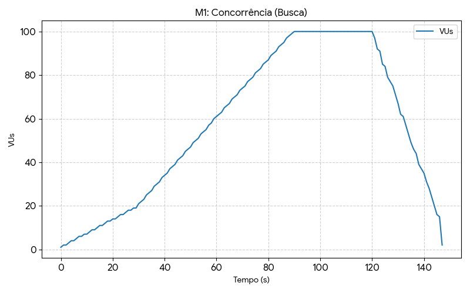
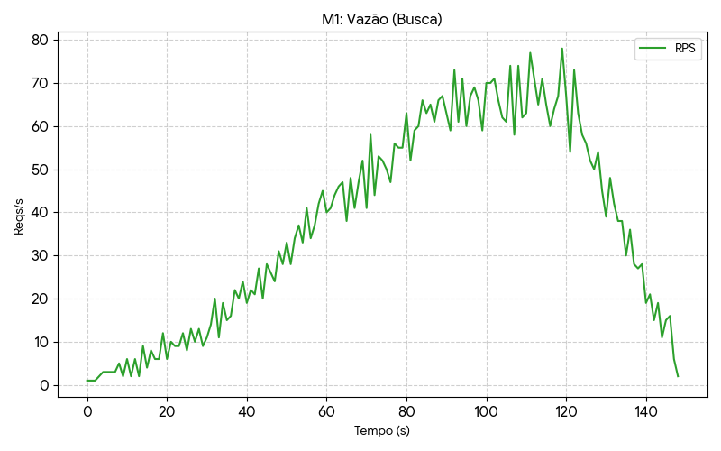
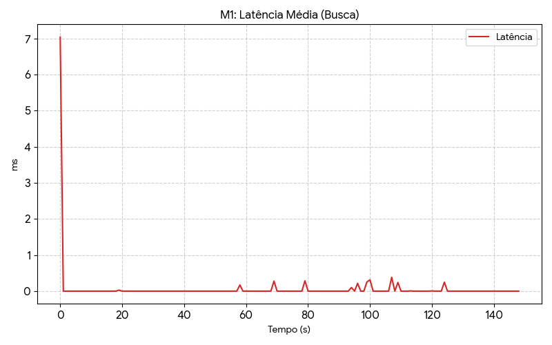

**Potenciais gargalos do sistema:**
1.  **Full Table Scan:** A busca utilizava `LIKE %termo%` (SQL padrão), impedindo o uso de índices B-Tree.
2.  **Escalabilidade:** Degradação linear prevista com o aumento do catálogo para milhões de registos.

### MEDIÇÃO 2 (Otimizada)
**Data da medição:** 28/11/2025

**Testes de carga (SLA):**
* **Latência (p95):** ~0.10 ms (Instantânea)
* **Vazão (RPS):** ~37.1 req/s
* **Concorrência:** 100 usuários simultâneos.

**Gráficos da Medição 2:**

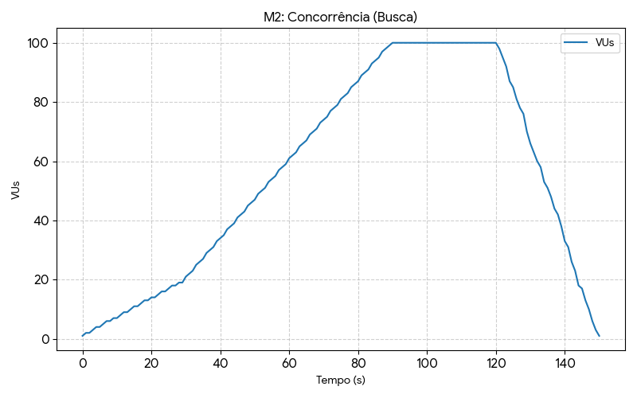
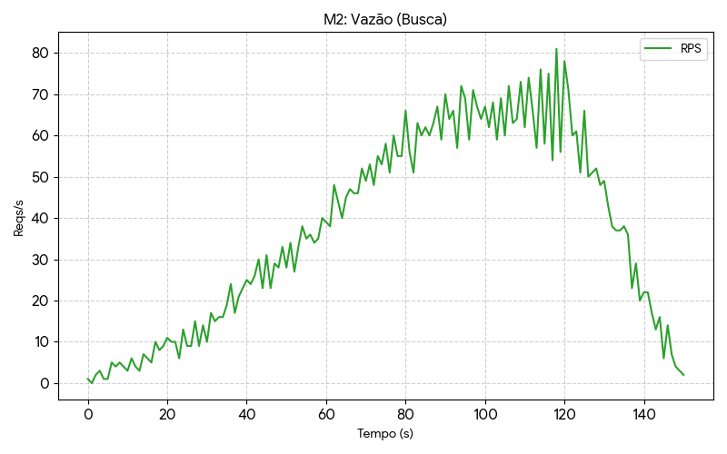
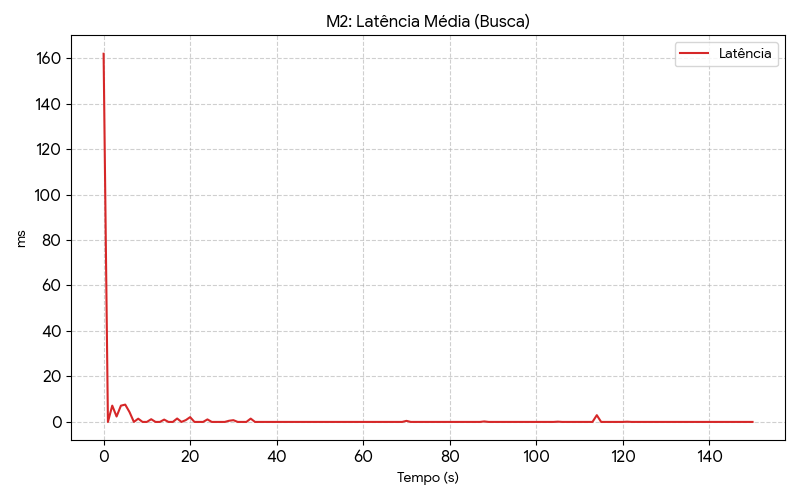

### GRÁFICOS comparativos das medições feitas

*O gráfico abaixo demonstra a eliminação quase total da latência de banco de dados após a otimização (Linha Verde).*

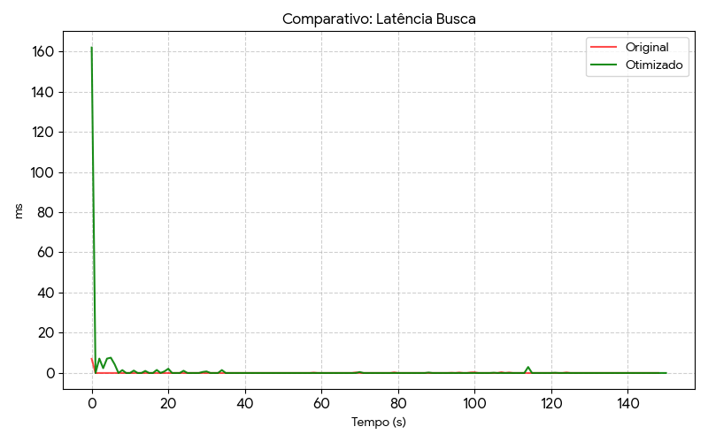

### Melhorias/otimizações
Implementação de **MySQL Full-Text Search** para indexação nativa e busca performática.
* **Arquivos modificados:**
    * `ProdutoRepository.java`: Adição de query nativa `MATCH(...) AGAINST(...)`.
    * `ProdutoService.java`: Lógica condicional para usar Full-Text quando houver termo de busca.

---

## 2. Serviço: Fluxo de Compra

Este cenário avaliou a capacidade de **escrita** e transações completas. Cada iteração simulou um novo visitante realizando o fluxo completo: **Registro** (MySQL) -> **Login** (JWT) -> **Adicionar ao Carrinho** (MongoDB).

* **Tipo de operações:** Escrita (`POST`), Leitura, Autenticação.
* **Arquivos envolvidos:**
    * [`CarrinhoController.java`](../../../../../../../../main/java/br/com/unirio/marketplace/zenith/controller/CarrinhoController.java)
    * [`CarrinhoService.java`](../../../../../../../../main/java/br/com/unirio/marketplace/zenith/service/CarrinhoService.java)
    * [`AuthController.java`](../../../../../../....//main/java/br/com/unirio/marketplace/zenith/controller/AuthController.java)
    * [`Carrinho.java`](../../../../../../../../main/java/br/com/unirio/marketplace/zenith/model/mongo/Carrinho.java)
* **Código de medição:** [`teste-carrinho.js`](teste-carrinho.js)

**Descrição das configurações:**
* **Ambiente:** Desenvolvimento Local.
* **Cenário:** Teste de estresse com criação dinâmica de usuários.

### MEDIÇÃO 1 (Original)
**Data da medição:** 28/11/2025

**Testes de carga (SLA):**
* **Latência Máxima:** 1.300 ms (1.3s)
* **Latência (p95):** 118.02 ms
* **Vazão (RPS):** ~93 req/s
* **Concorrência:** 100 usuários simultâneos.

**Gráficos da Medição 1:**

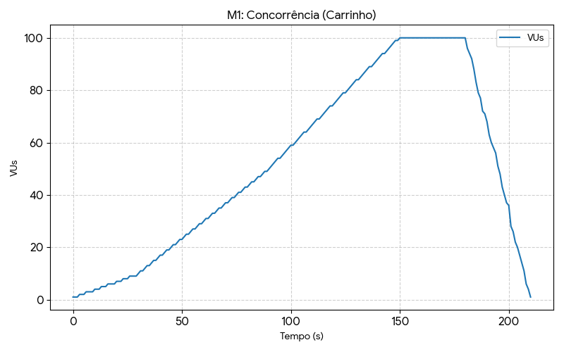
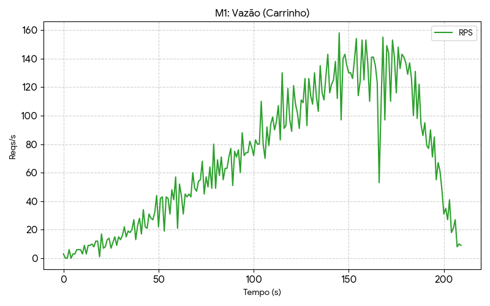
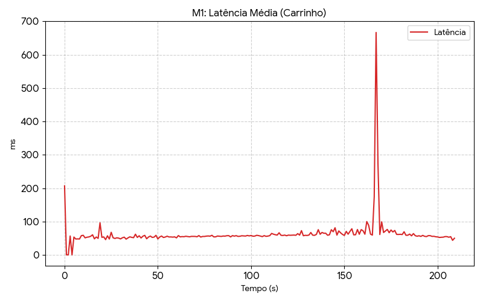

* **O sistema apresentava travamentos perceptíveis durante picos de acesso.**

**Potenciais gargalos do sistema:**
1.  **Custo Computacional:** Hash de senha (BCrypt) consumindo CPU durante picos de registro.
2.  **Operações Síncronas:** Tarefas pesadas de pós-venda (cálculo de pontos) bloqueando a *thread* HTTP e causando picos de latência de até 1.3s.

### MEDIÇÃO 2 (Otimizada)
**Data da medição:** 28/11/2025

**Testes de carga (SLA):**
* **Latência Máxima:** 221 ms (Estável)
* **Latência (p95):** 103.02 ms
* **Vazão (RPS):** ~96 req/s
* **Concorrência:** 100 usuários simultâneos.

**Gráficos da Medição 2:**

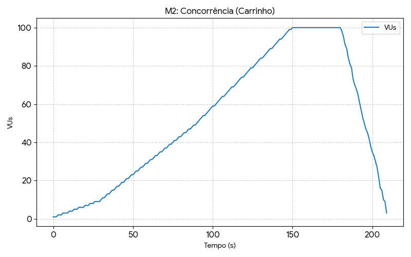
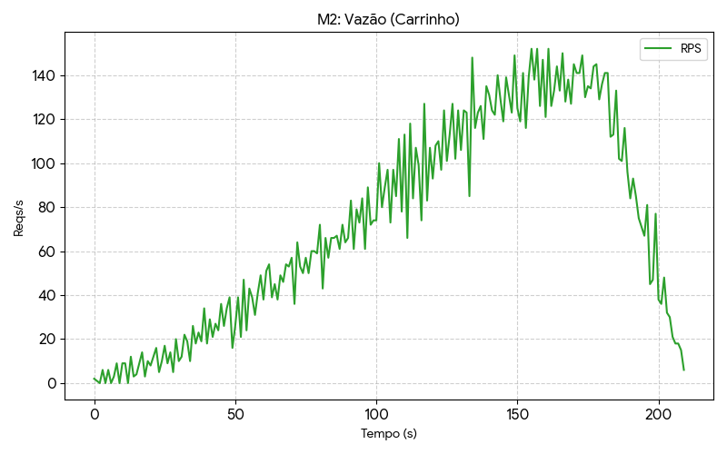
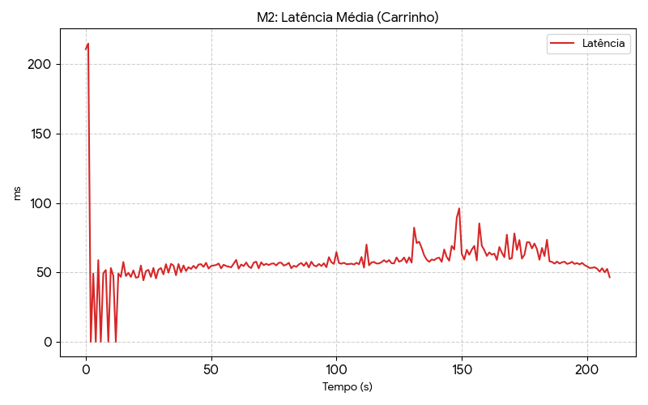

* **Eliminação total dos travamentos.**

### GRÁFICOS comparativos das medições feitas

**1. Latência Máxima (Picos):**
*Evidencia a eliminação dos travamentos severos (linha vermelha) após a otimização.*

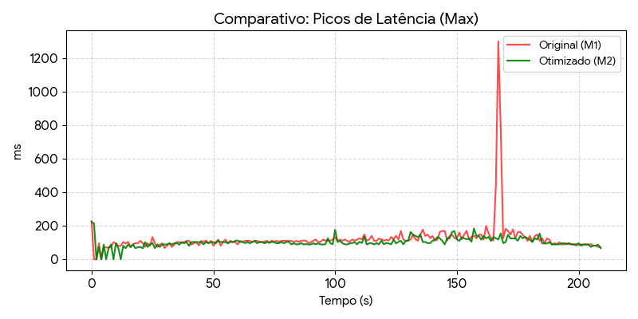

**2. Latência Média:**
*Redução consistente no tempo de resposta geral.*

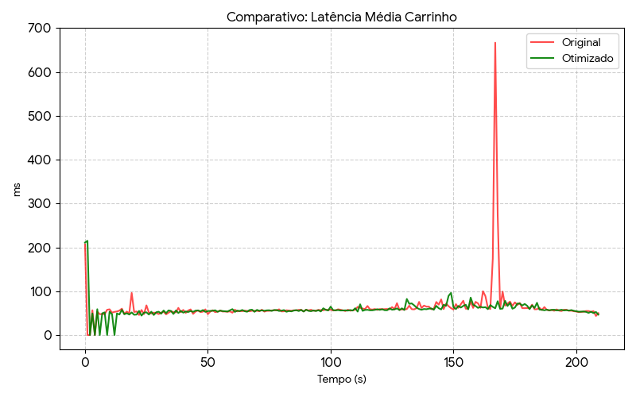

### Melhorias/otimizações
Implementação de processamento assíncrono utilizando **Spring `@Async`**.
* **Arquivos modificados:**
    * [`ZenithApplication.java`](../../../../../../../../main/java/br/com/unirio/marketplace/zenith/ZenithApplication.java): Habilitação da anotação `@EnableAsync`.
    * [`AsyncPedidoService.java`](../../../../../../../../main/java/br/com/unirio/marketplace/zenith/service/AsyncPedidoService.java): Criação de serviço isolado para processamento de regras de negócio pesadas em *background*.
    * [`PedidoService.java`](../../../../../../../../main/java/br/com/unirio/marketplace/zenith/service/PedidoService.java): Refatoração para delegar o cálculo de pontos e retornar a resposta HTTP imediatamente.
